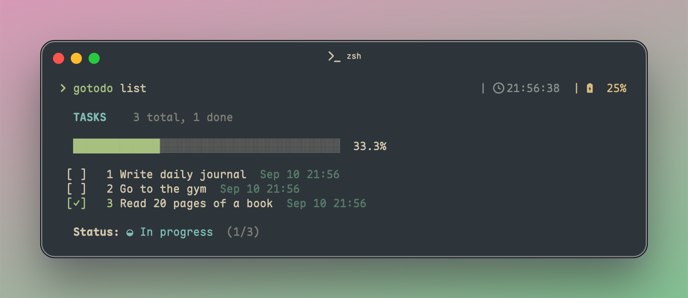

<p align="center">
  
</p>


> A tiny, delicate todo CLI written in Go.

<p align="center">
  
  
  
</p>

<div>
</img>
</div>

## ✨ Features

- 🚀 Simple and intuitive CLI interface
- 🔍 Automatic shell completion (bash, zsh, fish)
- 📝 Task management (add, list, done, delete, clear)
- 🎨 Color-coded output for better readability
- 💾 Persistent storage in JSON format
- 🌍 Cross-platform support (Linux, macOS, Windows)

## 🚀 Installation

### Using Go

```bash
go install github.com/ethanbao27/gotodo@latest
```

## Using Homebrew

```bash
brew install ethanbao27/tap/gotodo
```

### From Source

```bash
git clone https://github.com/ethanbao27/gotodo.git
cd gotodo
go build
```

### Using Binary

Download the latest binary from [Releases](https://github.com/ethanbao27/gotodo/releases)

## 🎯 Quick Start

Add your first task:

```bash
gotodo add "My first task"
```

## Usage

### Basic Commands

```bash
# Add a new task
gotodo add "Task content"

# List all tasks
gotodo list

# Mark a task as done
gotodo done <task-id>

# Delete a task
gotodo delete <task-id>

# Clear all tasks
gotodo clear --yes
```

### Using Different Storage Location

```bash
# Use a specific file to store tasks
gotodo --db /path/to/tasks.json list
```

### Shell Completion

gotodo supports shell completion for:

- Bash
- Zsh
- Fish

Shell completion is automatically configured during installation.

## Development

### Requirements

- Go 1.24 or later

### Build

```bash
go build
```

### Test

```bash
go test -v ./...
```

### Lint

```bash
golangci-lint run
```

## 📜 License

This project is licensed under the MIT License - see the [LICENSE](LICENSE) file for details.

## 🤝 Contributing

1. Fork the repository
2. Create your feature branch (`git checkout -b feature/amazing-feature`)
3. Commit your changes (`git commit -m 'Add some amazing feature'`)
4. Push to the branch (`git push origin feature/amazing-feature`)
5. Open a Pull Request

## Author

Created by [Ethan Bao](https://github.com/ethanbao27)

<a href="https://github.com/ethanbao27/gotodo/graphs/contributors">
  
</a>
